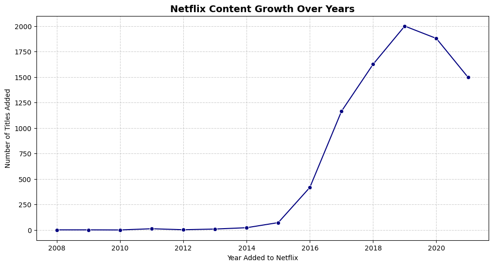
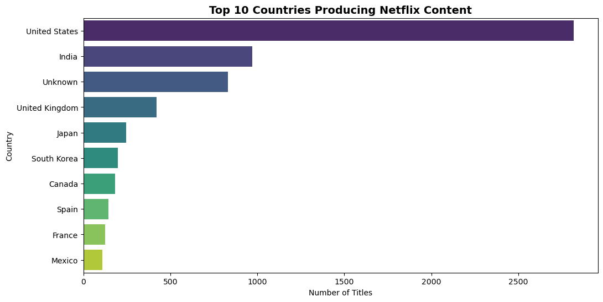
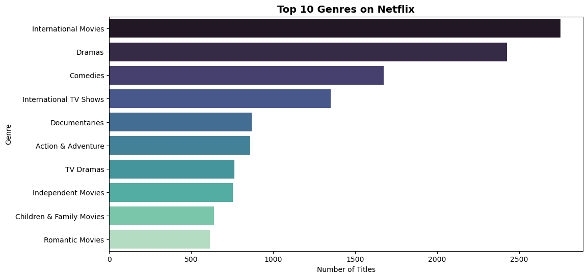
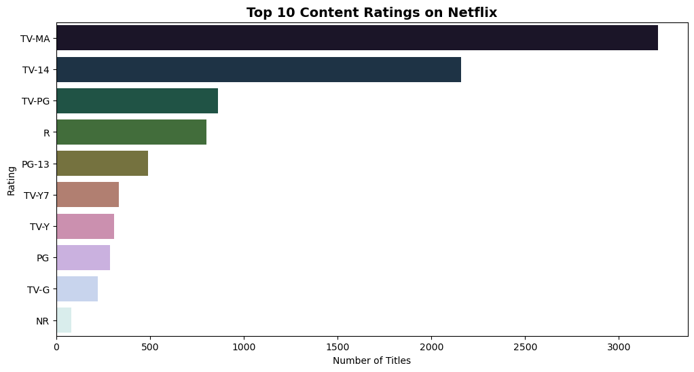

# Netflix Titles Dataset Analysis 
## Objective
Perform data cleaning and exploratory data analysis (EDA) on Netflix’s catalog to uncover patterns in content growth, geographic distribution, genres, and audience targeting.

## Workflow
1. Data Cleaning
   - Removed duplicates
   - Handled missing values
   - Converted dates and normalized duration
   - Extracted new features (`year_added`, `month_added`)

2. Exploratory Data Analysis (EDA)
   - Movies vs TV Shows distribution
   - Content growth trend over years
   - Top producing countries
   - Genre analysis
   - Ratings distribution

## Key Insights
- Netflix’s catalog grew rapidly between 2015–2018, peaking at ~2000 titles in 2018.
- Movies dominate the platform, with more than double the number of TV shows.
- The United States leads in content production, followed by India and the UK.
- International TV shows and dramas are the most common genres.
- Ratings skew toward mature audiences (TV‑MA).

## Visuals

### Movies vs TV Shows

### Content Growth Trend

### Top Producing Countries

### Top Genres

### Ratings Distribution

